# Raspberry Pi cloud-connected Hat Cam

A cloud-connected hat/clothing camera powered by a Raspberry Pi and Azure.


> This project builds a wearable, cloud connected camera. This is useful in situations where you want a record of what the camera sees stored in the cloud as quickly as possible. Make sure you use this in compliance will all applicable laws and privacy considerations.
> 
> This is video only, no audio. If you want to add audio, then I'd love a PR to add, or wait till I get a chance to add it.

This app requires a Raspberry Pi connected to a Raspberry Pi Camera and WiFi. It continuously records short videos from the camera (by default 10 seconds in length), and uploads these to Azure blob storage. The ideal setup it a Pi Zero W due to it's small size and low power requirements, tethered to a mobile phone for internet access.

> This uses a cloud service to store the videos, and therefor may incur a cost. If you have a free trial account, you can get $200 for the first 30 days which should more than cover the cost. Check out the [Blob storage pricing guide](https://azure.microsoft.com/pricing/details/storage/blobs/?WT.mc_id=pihatcam-github-jabenn) for more information on the cost of the service used.

This method allow resiliency - if WiFi connection is lost the uploaded will keep retrying. If the device is damaged then everything already uploaded will be secure. Files are stored on the SD card and only deleted after successfully being uploaded, so if there is no internet connection, files can be grabbed off the SD card.

This also allows audit trails - each short video is named with the current timestamp, and Blob storage stores the time the file was uploaded.

This code also includes a utility to download all the blobs and concatenate them into a single video file.

## What's required

To make this, you will need:

* A Raspberry Pi Zero W (must be the W with WiFi access)
* A Raspberry Pi camera module and appropriate ribbon cable that is as long as possible. The V2 camera is the best as it is small with good quality. The HQ camera can be used but is bigger which makes it harder to mount on clothing.
* An SD Card
* A USB power pack and appropriate cable to power the Pi
* A mobile phone to tether to
* A hat or other piece of clothing
* Sewing materials, duct tape, bits of cloth to help affix the camera and Pi to your clothes

## Set up the application

Before you can run the application, you need an Azure subscription and a storage account.

### Set up your Azure Subscription

* If you are a student aged 18 and up and have an email address from an academic institution, you can sign up for the free Azure for Students offer at [azure.microsoft.com/free/students](https://azure.microsoft.com/free/students/?WT.mc_id=pihatcam-github-jabenn) without a credit card. At the time of writing this gives you $100 of credit to use over 12 months, as well as free tiers of a number of services for that 12 months. At the end of the 12 months, if you are still a student you can renew and get another $100 in credit and 12 months of free services.

* If you are not a student, you can sign up at [azure.microsoft.com/free](https://azure.microsoft.com/free/?WT.mc_id=pihatcam-github-jabenn). You will need a credit card for verification purposes only, you will not be billed unless you decide to upgrade your account to a paid offering. At the time of writing the free account will give you US$200 of free credit to spend on what you like in the first 30 days, 12 months of free services, plus a load of services that have tiers that are always free.

### Set up the storage account

An Azure storage account is a general purpose account to store data as files, queues, tables or blobs. In this app, each short video is stored as a blob in the storage account.

To create a storage account:

1. Head to [ms.portal.azure.com/#create/Microsoft.StorageAccount-ARM](https://aka.ms/AA8xjmk) to go straight to the create a new storage resource blade

1. Sign in with your Azure account if necessary

1. Select your Azure subscription

1. For the *Resource group*, select **Create new**. Name the resource group `hatcam` then select **OK**

    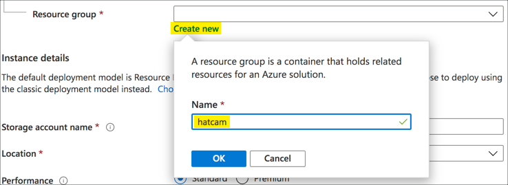

1. Name the storage account. This name has to be globally unique across all storage accounts in Azure - this is because this name becomes part of the URL that can be used to access it. Pick a name that makes sense to you with something unique like your name, the date, etc.

    > This name can only contain lowercase numbers and letters

1. For the location, select the one closest to where you will be using the camera.

    > If you want to see the locations of the regions, check out the map in the [Azure global infrastructure guide](https://azure.microsoft.com/global-infrastructure/regions/?WT.mc_id=pihatcam-github-jabenn).

1. Leave the rest of the values as the defaults

    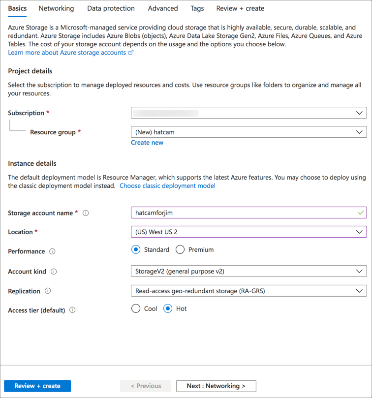

1. Select **Review + create**

1. The storage account settings will be validated. Once done, select **Create**.

The deployment will begin. You will be notified when it's complete.

### Get the connection string

To connect to the storage account, you will need a connection string. To get this:

1. Open the storage account in the Azure portal. You can do this by selecting **Go to resource** from the notification that pops up with the storage account is deployed.

    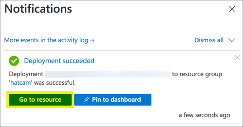

1. From the side bar, select **Settings -> Access keys**

    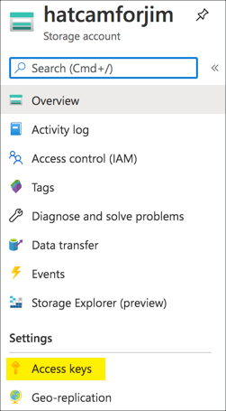

1. Select the **Copy to clipboard** button next to the *Connection string* under either *Key 1* or *Key 2*. It doesn't matter which one.

    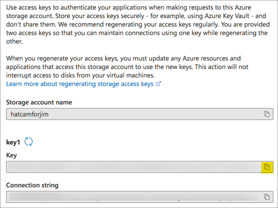

1. Store this connection string somewhere. You'll need it to configure your Pi code.

## Deploy the code

Once you have the storage account, it's time to deploy the code. The code is fully documented and commented, so check out the [`app.py`](./pi-app/app.py) file to see how it all works.

### Configure the Pi

You will need to be running the latest Raspberry Pi OS on your Pi Zero W. To make the camera faster to launch, you should install Raspberry Pi OS Lite.

To do this, use the [Raspberry Pi imager](https://www.raspberrypi.org/blog/raspberry-pi-imager-imaging-utility/). When you choose the OS, select **Raspberry Pi OS (other)**, then select **Raspberry Pi OS Lite (32 bit)**.

Once your SD card is ready, configure the Pi for headless access by following the steps in this [headless setup guide](https://github.com/microsoft/rpi-resources/tree/master/headless-setup#setting-up-ssh-and-wifi). Work through the steps up to the *Remote desktop* section - you don't need to follow this section as it contains instructions when using the full Raspberry Pi OS, not the Lite version you are using here.

### Deploy the Python code

The Python code you need is in this repo in the `pi-app` folder.

1. SSH into your Pi

1. Install git, Pip and Python virtual environments using the following command:

    ```sh
    sudo apt install git
    sudo apt install python3-pip
    sudo apt install python3-venv
    ```

1. Clone this repo:

    ```sh
    git clone git@github.com:jimbobbennett/pi-hat-cam.git
    ```

1. Navigate to the folder containing the code

    ```sh
    cd pi-hat-cam/pi-app
    ```

1. Create a [Python Virtual Environment](https://docs.python.org/3/tutorial/venv.html#:~:text=%20Virtual%20Environments%20and%20Packages%20¶%20%201,upgrade%2C%20and%20remove%20packages%20using%20a...%20More%20):

    ```sh
    python3 -m venv .venv
    ```

1. Activate the virtual environment:

    ```sh
    source ./.venv/bin/activate
    ```

1. Install the Pip packages

    ```sh
    pip install -r requirements.txt
    ```

### Configure the app

Once the code is deployed, you'll need to configure the app to connect to your Azure storage account.

The code uses the `dotenv` package to read environment variables from a `.env` file. You will need to create this file and add the Azure storage connection string that you copied earlier to it.

1. Create the file and open it for editing in `nano`:

    ```sh
    nano .env
    ```

1. Add the following entry:

    ```sh
    BLOB_CONNECTION_STRING=<connection_string>
    ```

    Replace `<connection_string>` with the connection string you copied earlier.

1. Close the file by pressing *ctrl+X*. You will be prompted to save the file, so select `yes` and press enter to select the `.env` filename.

> There are other optional parameters you can add to this file to configure things like the video resolution or quality. Check out the `app.py` code for more details.

### Test the app

Before you use this in the wild, you should test the app.

1. Connect the camera to the Pi

1. Run the Pi code with this command:

    ```sh
    python app.py
    ```

1. The app will start up and begin recording, uploading videos to blob storage once they are recorded. You should see something like this in the output:

    ```output
    (.venv) pi@hat-cam:~/pi-hat-cam $ python app.py
    Checking container videos
    Setting camera resolution to 1280 , 720
    Starting queue worker
    Recording ./videos/2020-07-08 07:42:51.h264
    Queuing ./videos/2020-07-08 07:42:51.h264
    Recording ./videos/2020-07-08 07:43:01.h264
    Uploading ./videos/2020-07-08 07:42:51.h264 to 2020-07-08 07:42:51.h264
    Deleting ./videos/2020-07-08 07:42:51.h264
    ```

1. Stop the app using *ctrl+c*

1. Head to the storage account in the Azure portal.

1. Select **Storage Explorer** from the side menu

    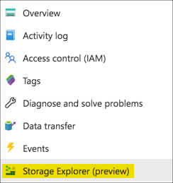

1. You should see the blob files that were uploaded listed here

    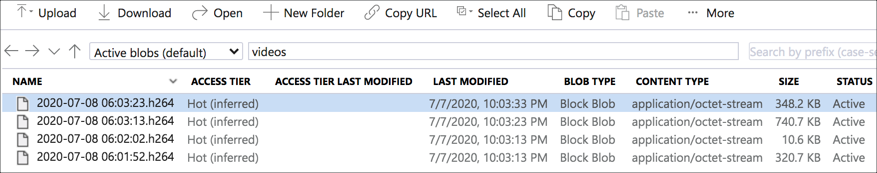

You can download these files by selecting one and selecting **Download**. The downloaded file can be opened in an app like [VLC](https://www.videolan.org/vlc/index.html).

### Configure the app to run on startup

Once the app is deployed, it can be run manually from the command line. It's better, however, if it is started when the Pi is booted - that way it is running automatically not long after the Pi is connected to power.

You can do this by adding an entry to the crontab. Cron is a tool that runs code at certain times, and can be configured to run the Pi code when the Pi is rebooted.

1. Run the following code to configure the CronTab:

    ```sh
    sudo crontab -l > cron.tmp
    echo "@reboot sleep 30 && cd /home/pi/pi-hat-cam/pi-app && /home/pi/pi-hat-cam/pi-app/.venv/bin/python /home/pi/pi-hat-cam/pi-app/app.py" >> cron.tmp
    sudo crontab cron.tmp
    rm cron.tmp
    ```

This code writes a new entry that is run on reboot. First it sleeps for 30 seconds to ensure the Pi is fully running and connected to the internet, then it launches the `app.py` file using the Python binary in the virtual environment.

Test this out by rebooting the Pi. You should see video files appear in the Storage Explorer in the Azure portal. Power the Pi off when done.

## Download the video

By creating short videos it helps ensure the videos are uploaded, but this is not the best for watching later. It would be easier if there was a way to reassemble the video. The `video_downloader.py` file in the `downloader` folder has code to do this.

This file needs a `.env` file set up the same as the main app, with the `BLOB_CONNECTION_STRING` value set. There are other values you can configure from the default, and this are listed in the code.

Ideally you should run this code on a device that is not the Pi, so that you can view the video. You will need Python installed.

1. From the folder the `video_downloader.py` is in, create a [Python Virtual Environment](https://docs.python.org/3/tutorial/venv.html#:~:text=%20Virtual%20Environments%20and%20Packages%20¶%20%201,upgrade%2C%20and%20remove%20packages%20using%20a...%20More%20):

    ```sh
    python3 -m venv .venv
    ```

    On Windows, use:

    ```cmd
    python -m venv .venv
    ```

1. Activate the virtual environment:

    ```sh
    source ./.venv/bin/activate
    ```

1. Install the Pip packages

    ```sh
    pip install -r requirements.txt
    ```

1. Create a file called `.env` in your favorite text editor, such as [Visual Studio Code](https://code.visualstudio.com?WT.mc_id=pihatcam-github-jabenn)

1. Add the following entry:

    ```sh
    BLOB_CONNECTION_STRING=<connection_string>
    ```

    Replace `<connection_string>` with the connection string you copied earlier.

1. Run the code:

    ```python
    python video_downloader.py
    ```

This will download all the blobs, concatenating them into a single file called `downloaded_video.h264`. You can then view ths file in an app like [VLC](https://www.videolan.org/vlc/index.html).

> The blobs are not deleted when you download them. You will need to manually delete them from the storage resource once you are finished with them.

## Create the wearable

There's so many different pieces of clothing you could attach this to. In this guide I'm going to focus on a cap.

You will need:

* A cap that you don't mind making holes in
* Scissors
* Gaffer tape, or offcuts of fabric and needle and thread depending on how good you are at sewing (I'm not very good)
* Double sided mounting tape
* A USB power pack and USB cable that can reach from the pack in a pocket or strapped to a belt to the hat

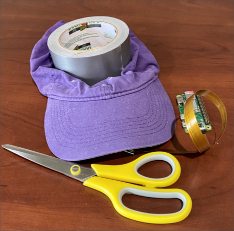

### Mount the camera

1. Make a small hole in the front of the cap - big enough for the camera lens to fit through

1. Place the camera inside the hat and push the lens through the hole. It might be easier to detach the camera from the board to pass it through the hole.

    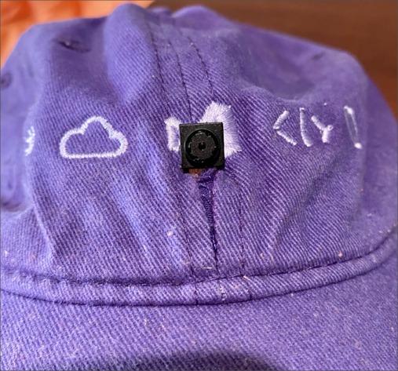

1. Fix the camera in place on the front of the hat with double-sided mounting tape. You can use fabric glue, but be careful not to get any on the lens. This also reduces you ability to easily re-use the camera in a different make.

1. Fix the camera circuit board in place inside the cap using gaffer tape

   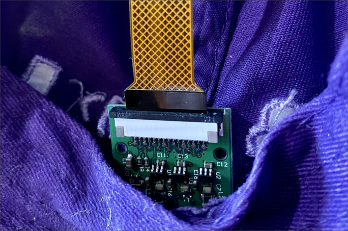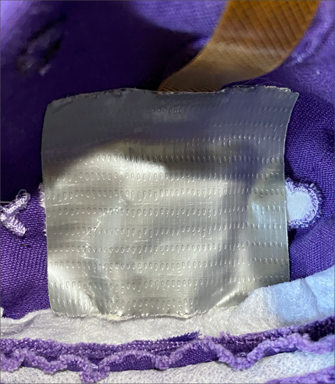

1. Fix the camera ribbon cable to the inside of the cap, right through to the hole at the back. Use gaffer tape or sew it in place.

    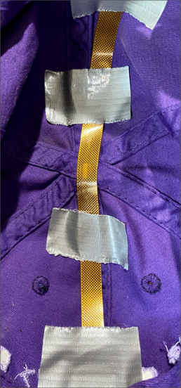

1. Mount the Raspberry Pi Zero W to the back of the cap, attaching the camera ribbon cable. Use double sided mounting tape, gaffer tape or sew it in place, whatever works. The USB sockets should point downwards.

    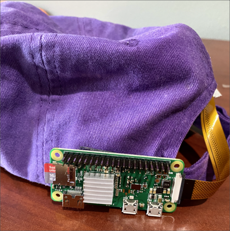

1. Test out the connections - power the Pi over USB and make sure videos are being uploaded. Also test out the fit and camera position, adjust it as necessary using tape or fabric.


## Use the camera

To use the camera, first it needs to be tethered to your phone or a WiFi hotspot to upload the videos. To tether:

1. Connect to the Pi over SSH

1. Start your WiFi hotspot, or enable tethering on your phone

1. From your Pi, launch the configuration tool:

    ```sh
    sudo raspi-config
    ```

1. Select **2 Network options**

    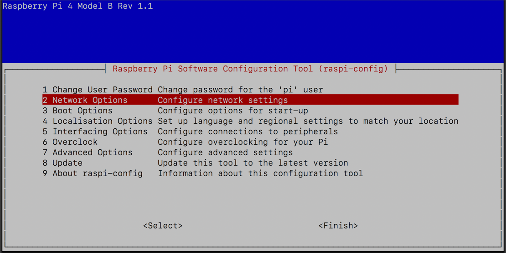

1. Select **N2 Wireless LAN**

    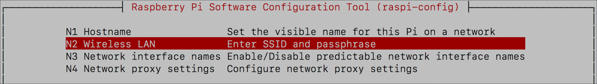

1. Enter the SSID and Password of your hotspot

1. Select **Finish**

1. When asked to reboot, select **Yes**

When the Pi reboots, it will connect to your hotspot or phone.

Power off the camera until you are ready to use it.

Once you are ready to use it, connect the power and it will start recording as soon as it has booted up.

Here's the camera in action browsing this repo:

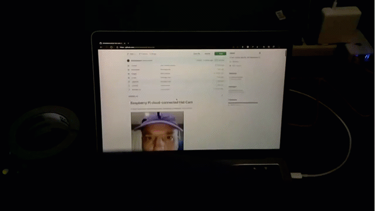